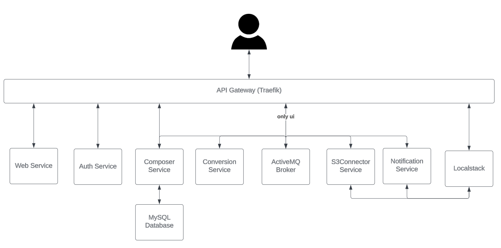

# Goal
University of Aveiro

Service Oriented Architecture (*SOA*) Master's class aiming at deploying our business product (Converter Web App) to a *Kubernetes* cluster. We worked on a project in a group of four for a Master's class at the University of Aveiro. It demanded effective teamwork and communication skills.

# Final Result
As a final result, a working app has been deployed to a *Kubernetes* cluster.

# Key Aspects
During the project I gained my first hands-on experience with handling API Gateway's:
 - Ingress traffic (featuring *Kubernetes* *Traefik*) to perform redirections to the external OAuth2 service - *Auth0* (the same as *ChatGPT* uses).
 - Request / Response custom headers allows to control e.g. *CORS* policies
 - *Localstack* is literally a local instance of *AWS*

# Deployment Diagram
Composer Service (Backend) is located here https://github.com/Sevelantis/SOA-ESB-like-backend-python

# Message Sequence Diagram
Understand the Application information flows.

# Directory Tree
In order to facilitate the organization of the files, they have been divided as follows. 

